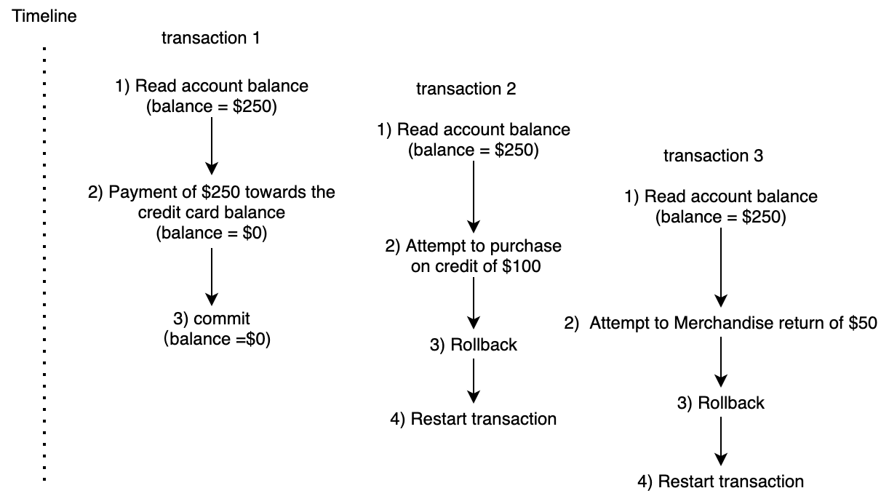

# Tutorial 12

## Question

1. The Lowprice Supermarket credit card department runs a multiuser DBMS. A corporate account ( w i t h m u l t i p l e c a r d h o l d e r s ) had a balance due of $250.00 when the following three transactions for this account were processed at about the same time in the following order (i.e., each of the three transactions reads the account record when the balance was $250.00 before any of the other transactions were completed): 1) Payment of $250.00 towards the credit card balance; 2) Purchase on credit of $100.00 (charged to the credit card); 3) Merchandise return of $50.00 (refund to the credit card). 
	* a. If the DBMS does not enforce concurrency control, show the sequence of events for the above-mentioned situation. What balance will be recorded for the customer after the three transactions have been processed? 
	* b. If the DBMS enforces concurrency control by a proper locking mechanism, show the sequence of events for processing the transactions. What balance will be recorded for the customer after the three transactions have been processed? 
	* c. If versioning is implemented for concurrency control, show the sequence of events for processing the transactions in the order shown above. What balance will be recorded for the customer after the three transactions have been processed (before restarting any transaction)?

2. For each situation described below, decide the appropriate recovery techniques to be applied: 
	* a. The network connection is lost while a user is entering a transaction. 
	* b. A disk drive fails during regular operations. 
	* c. A lightning storm causes a power failure. 
	* d. An incorrect amount was entered and posted for a student tuition payment. The error was not discovered for several weeks.
4. 
## Answers

1. A **credit card balance** is the total amount of money you owe the **credit card** company at any given time. This is different from the statement **balance**, which is the amount of money you owe at the end of a billing cycle, or the minimum monthly payment you must make to keep your account in good standing 
* 
* 
* 

2. **a) Failure type: Abort transaction**
* Rollback, if not rollforward/ return transactions to state just prior to abort
 **b) Failure type: Database destruction**
* switch to duplicate database, if not rollback, if not restart from checkpoint (rollforward)
**c) Failure type: System failure (database intact)**
* switch to duplicate database, if not rollback, if not restart from checkpoint (rollforward)
**d) Incorrect data (update inaccurate)**
* Rollback, Reprocess transactions without inaccurate data updates, compensating transactions

|Type of failure  |  Recovery technique|
|--|--|
| Abort transaction | Rollback (preferred), Rollforward/return transactions to state just prior to abort |
| Incorrect data(update inaccurate) | Rollback (preferred), Reprocess transactions without inaccurate data updates, compensating transactions |
| System failure(database intact) | Switch to duplicate database (preferred), Rollback, restart from checkpoint(rollforward) |
| Database destruction | Switch to duplicate database (preferred), Rollforward, Reprocess transactions |

3. 
## Teachers's Answers

2. Appropriate recovery techniques: 
	 * a. Aborted transaction: the transaction needs to be re-entered. 
	 * b. Database destruction: I f t h e r e i s m i r r o r s y s t e m , s w i t c h o v e r t o t h e m i r r o r s y s t e m . I f n o t , use forward recovery to recover from the backup copy of the database. 
	 * c. System failure: use forward recovery to recover all the completed transactions from the most recent checkpoint. 
	 * d. Incorrect data: enter a compensating transaction (or retract the incorrect payment and make a correct payment), i.e., correct the error manually, and notify the student of the error.